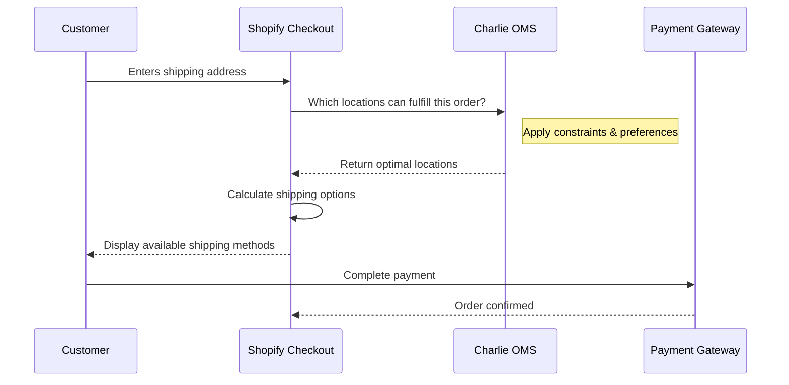

The most common technical question partners hear: *"What does this integrate with?"* This page gives you the answer.

## How routing happens

Charlie runs as **Shopify Functions**, executing natively inside Shopify's infrastructure at checkout — before the order exists. This means:

- No ERP integration required (the order hasn't been created yet)
- No WMS connection needed (routing is decided before fulfillment begins)
- No latency added to checkout
- No impact on post-order workflows

Once an order is placed and routed, it flows into Shopify's standard fulfillment process — which connects to whatever the client already uses (ERP, WMS, 3PL, carrier) without any changes.

## What Charlie doesn't replace

Charlie doesn't integrate with ERPs — intentionally. It leverages Shopify's existing interfaces, so the client's ERP continues to receive orders exactly as before. Nothing changes downstream.

| System | Charlie's relationship |
|---|---|
| ERP (SAP, Cegid, etc.) | Untouched — order flows in as normal post-routing |
| WMS | Untouched — fulfillment execution is unchanged |
| 3PL | Untouched — carrier and shipment logic unchanged |
| Shopify POS | Enhanced — safety stock visibility and revenue attribution |
| Shopify admin | Enhanced — Charlie lives inside it, no second screen |

## On inventory integrations

Charlie's safety stock feature works with Shopify's native inventory. For clients using third-party tools that also read Shopify's native stock (e.g. a storefront app, a B2B portal, a POS extension), a proper safety stock setup requires that those tools also respect sellable inventory — not just raw available stock.

Charlie doesn't currently have native integrations with these tools, but is actively building them. Ask the Charlie team for the current status if a specific tool is relevant for your client.

## IS/IT impact

<CardGroup cols={2}>
  <Card title="Zero IT burden" icon="check">
    No integration requirements, no ongoing maintenance, no version conflicts.
  </Card>
  <Card title="Auto-evolving" icon="arrows-rotate">
    Charlie updates automatically with Shopify — no deployment needed.
  </Card>
  <Card title="Clean uninstall" icon="trash">
    All data stored in Shopify metafields. Remove the app without data loss or migration.
  </Card>
  <Card title="No ERP integration" icon="plug">
    Routing happens before orders are created — the ERP never needs to know Charlie exists.
  </Card>
</CardGroup>

## The one integration that requires dev work

Charlie's safety stock feature can display accurate sellable inventory on the client's storefront. This requires a **front-end theme integration** — a few days of development work.

This is the only touch point that involves your agency's dev team.

<Card title="Custom development" icon="arrow-right" href="/technical/custom-development" horizontal>
  See exactly what the theme integration involves and how to scope it.
</Card>
